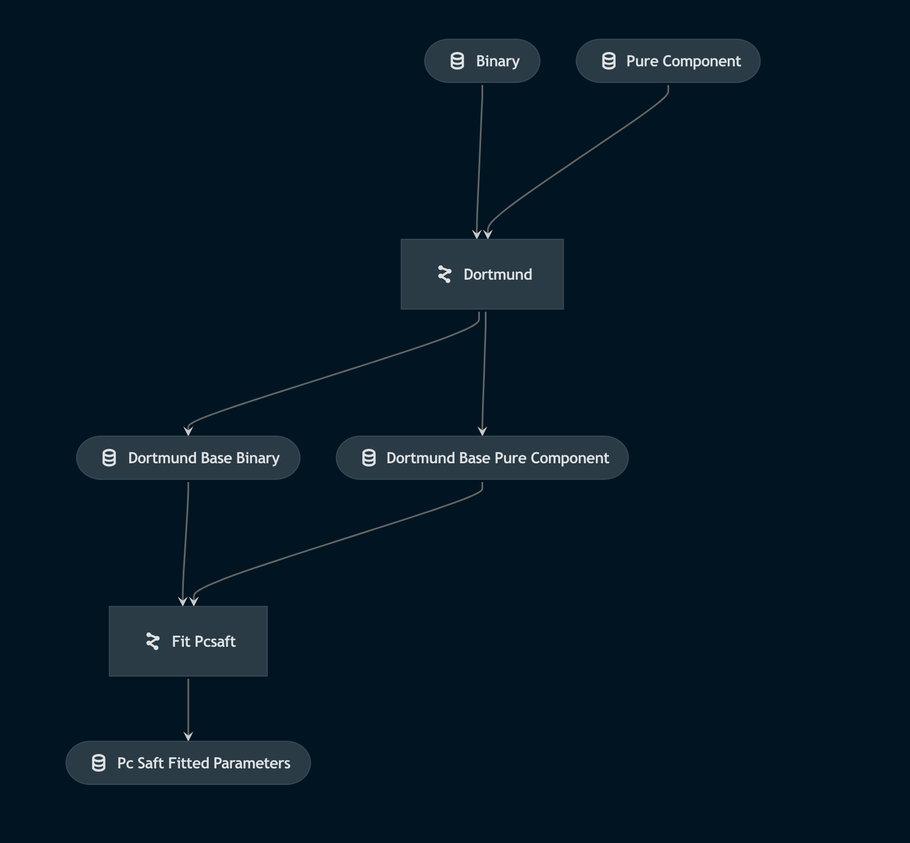

# DL4Thermo

This project aims to build a method for predicting equation of state parameters directly from molecular structures. We use PC-SAFT as the equation of state in this case study.

## Research 

This work was published in the [Chemical Engineering Journal](https://doi.org/10.1016/j.cej.2024.151999)

The preprint can be found [here](https://chemrxiv.org/engage/chemrxiv/article-details/6456371107c3f029374e6608).


## Getting started

This project uses `Kedro 0.18.0`, a packaage for managing data science projects. You can read more about Kedro in their [documentation](https://kedro.readthedocs.io) to get started. However, step-by-step instructions for this project are given below.


## Developer setup

First, clone the repository:

```
git clone https://github.com/sustainable-processes/dl4thermo.git
```

We're using [git LFS]((https://docs.gitlab.com/ee/topics/git/lfs/#using-git-lfs)) for large data files, so make sure to set that up. Run the following to get the large files:

```
git lfs fetch origin main
```

Then, make sure to unzip the directories in `data/01_raw`.


### How to install dependencies

We use poetry for dependency management. First, install [poetry](https://python-poetry.org/docs/#installation) and then run:

```
poetry install --with=dev
poe install-pyg
```
This will download all the dependencies.

**Notes for Mac users**:
- Note that if you run on Mac OS, you'll need to have Ventura (13.1 or higher).
- First run this set of commands:
    ```
    arch -arm64 brew install llvm@11
    brew install hdf5
    HDF5_DIR=/opt/homebrew/opt/hdf5 PIP_NO_BINARY="h5py" LLVM_CONFIG="/opt/homebrew/Cellar/llvm@11/11.1.0_3/bin/llvm-config" arch -arm64 poetry install
    ```
  If this commnad fails, make sure to check the version of LLVM that was actually installed (i.e., run ls /opt/homebrew/Cellar/llvm@11/) and replace 11.1.0_3 in the third line above with the correct version.

### Making predictions

Use the `make_predictions.py` command line script to make predictions of PCP-SAFT parameters. The scripts takes in a path to a text file with a SMILES string on each line.

```bash
python make_predictions.py smiles.txt
```

where smiles.txt might be

```
C/C=C(/C)CC
CC(C)CC(C)N
CCCCCCN
CC(C)CC(=O)O
```
    

### How to visualize and run Kedro pipelines

Kedro is centered around [pipelines](https://kedro.readthedocs.io/en/0.18.0/nodes_and_pipelines/pipeline_introduction.html). Pipelines are a series of functions (called nodes) that transform data.

The easiest way to understand pipelines in this repository is using `kedro-viz`. `kedro-viz` is a web app that visualizes all pipelines via a dependency graph, as shown in the example below.



You can run `kedro-viz` using the following command:

```
kedro viz --autoreload
```
Add the autoreload flag to have the visualization automatically refresh on code changes.

You can run all Kedro pipelines in the project using:

```
kedro run
```

However, running all pipelines is usually unnecessary since many of the data processing outcomes are cached via `git LFS`.  Instead, you can run a specific pipeline. For example, here is how to run only the Dortmund database processing pipeline:

```
kedro run --pipeline ddb
```

### Configuration

Kedro relies on a configuration system that can be a bit unintuitive. All configuration is stored inside `conf`. Inside `conf`, you will see the following directories:

- `base`: Used for configuration stored in git
- `local`: Used for configuration only stored on your machine

Each of the above directories has two important configuration filees:

- `catalog.yml`: Describes the [Data Catalog](https://kedro.readthedocs.io/en/0.18.0/data/data_catalog.html), a flexible way of importing and exporting data to/from pipelines. I strongly recommend skimming the [examples](https://kedro.readthedocs.io/en/0.18.0/data/data_catalog.html) in the documentation to get a feel for how the Data Catalog works
- `parameters/**.yml`: The parameters files for each pipeline contain parameters that can be referenced inside the pipeline. Note that parameters are needed for **any node input that does not come from the Data Catalog or a previous node**. To see how to reference parameters, look at the Dortmund data processing pipeline. 


### Rough instructions to reproduce results from our paper

1. (Optional) Process the Dortmund data. This includes resolving SMILES strings, filtering data, and generating conformers.
   Note, these pipelines will not work without manually downloading the data from Dortmund databank, which is commercial.

  ```bash
  kedro run --pipeline ddb
  kedro run --pipeline ddb_model_prep
  ```

2. (Optional) Generate COSMO-RS pretraining data.

  ```bash
  kedro run --pipeline cosmo
  ```

3. Train model for predicting dipole moments

  ```bash
  kedro run --pipeline train_spk_mu_model
  ```

4. (Optional) Fit PC-SAFT parameters - This requires the Dortmund databank since it uses the output from step 1. 

  ```bash
  # Regression on Dortmund data
  kedro run --pipeline pcsaft_regression

  # Generate LaTex table with stats about fitting
  kedro run --pipeline pcp_saft_fitting_results_table

  # (Optional) Run regression on COSMO-RS data
  kedro run --pipeline pcsaft_cosmo_regression
  kedro run --pipeline pcp_saft_cosmo_fitting_results_table
  ```

5. Train models - this can be run using the input files in `data/05_model_input`.

  ```bash
  # Preprocess data
  kedro run --pipeline prepare_regressed_split

  # Train feed-forward nework
  kedro run --pipeline train_ffn_regressed_model

  # Train random forest
  kedro run --pipeline train_sklearn_regressed_model

  # Train D-MPNN model
  kedro run --pipeline train_chemprop_regressed_model

  # Train MPNN model
  kedro run --pipeline train_pyg_regressed_model

  # Pretrain on COSMO-RS and fine-tune on Dortmund
  # Make sure to update the checkpoint_artifact_id under
  # pyg_regressed_pcp_saft_model.train_args in 
  # conf/base/parameters/train_models.yml
  # to the one from the pretrain run on wandb
  kedro run --pipeline train_pyg_pretrain_cosmo_model
  kedro run --pipeline train_pyg_regressed_model
  ```

6. Evaluate models

  Make sure update `results_table` in `conf/base/parameters/results_analysis.yml` with the correct wandb files.

  ```bash
  kedro run --pipeline  results_table
  ```

### How to work with Kedro and notebooks


To use JupyterLab, run: 

```
kedro jupyter lab
```

And if you want to run an IPython session:

```
kedro ipython
```

For both, you will need to run the following cell magic to get the [Kedro global variables](https://kedro.readthedocs.io/en/latest/11_tools_integration/02_ipython.html#load-datacatalog-in-ipython).

```python
%load_ext kedro.extras.extensions.ipython
%reload_kedro
```

You can then load data like this:

```python
df = catalog.load("imported_thermoml")
```


